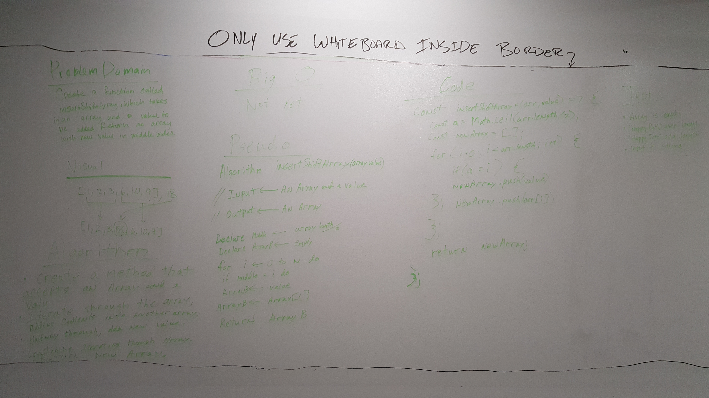
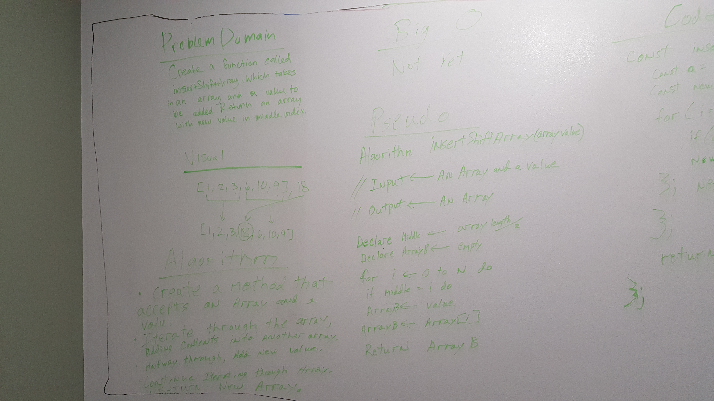
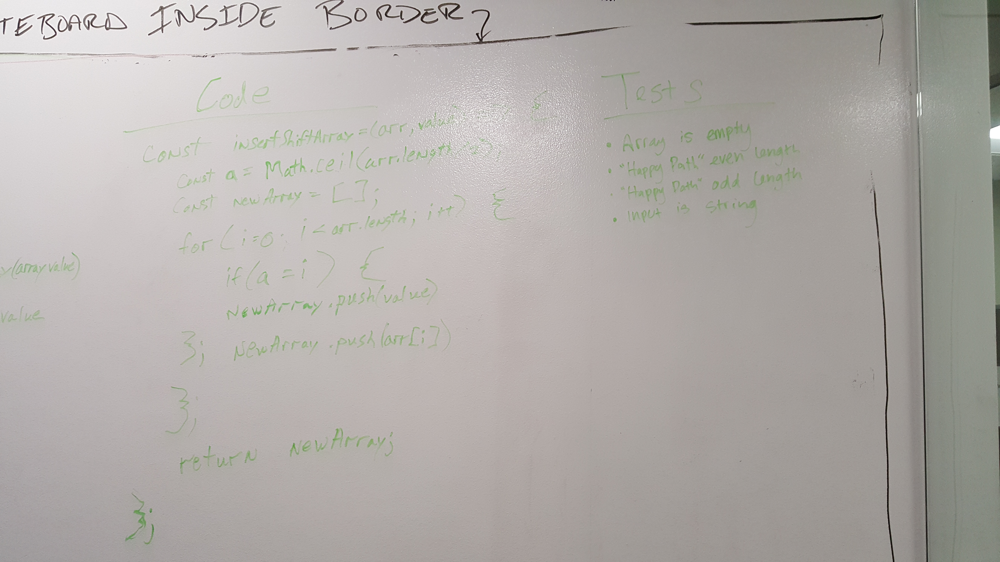

# Insert and shift middle index of array
Insert a value into the middle of an array without using built-in methods for doing so.

## Challenge
Write a function called ```insertShiftArray``` which takes in an array and the value to be added. Without utilizing any of the built-in methods available to your language, return an array with the new value added at the middle index.

## Solution


